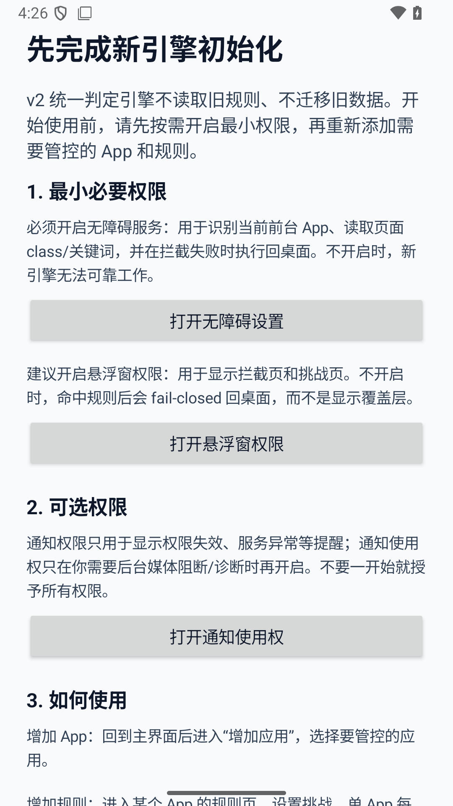
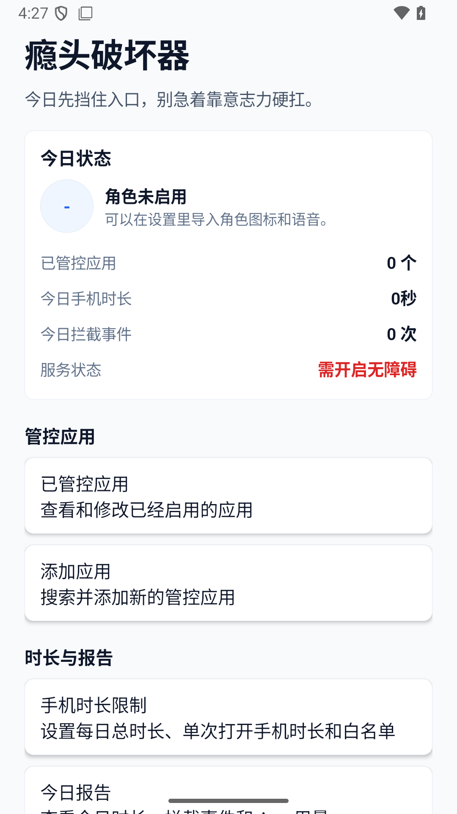
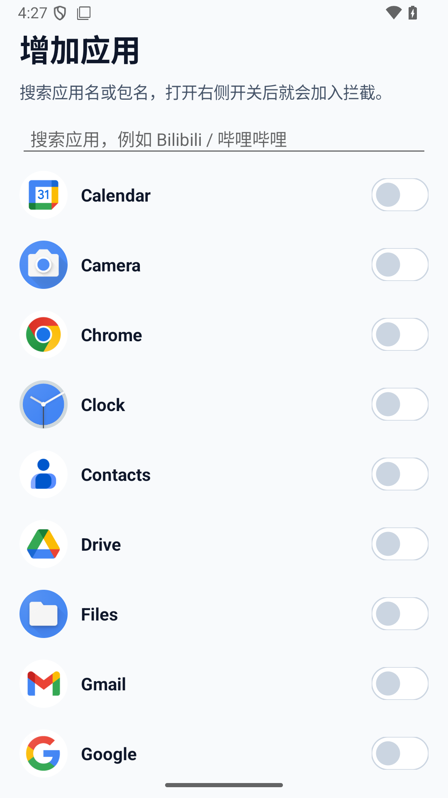
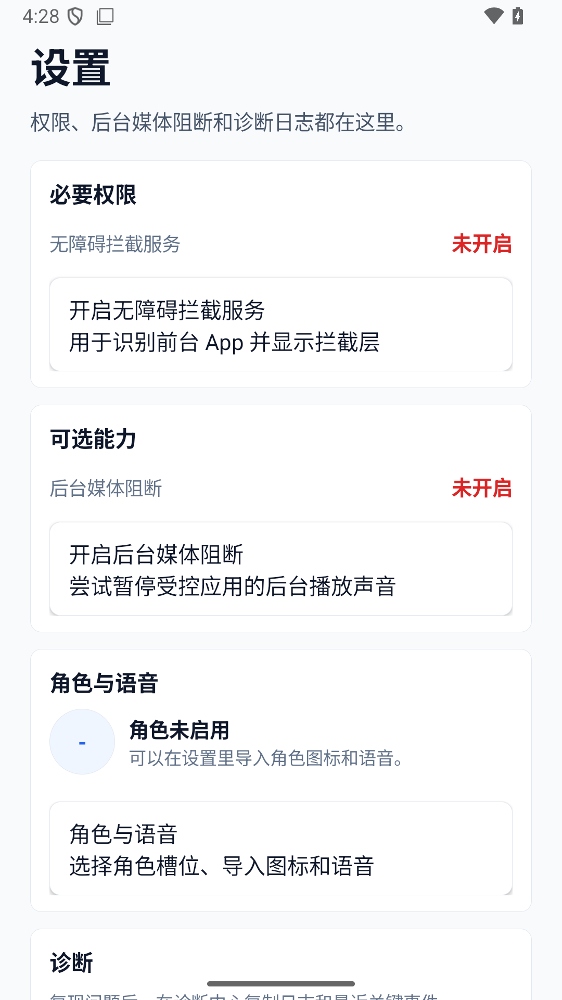

# AddictionBuster

[](https://github.com/corlite/AddictionBuster/actions/workflows/android-ci.yml)

[简体中文](README.zh-CN.md) · [Privacy](PRIVACY.md) · [Security](SECURITY.md) · [Compatibility](docs/device-compatibility.md) · [Contributing](CONTRIBUTING.md) · [License](LICENSE)

AddictionBuster is an open-source Android digital wellbeing tool for interrupting compulsive app-opening loops.

Instead of only blocking apps, AddictionBuster adds intentional friction before access: waiting periods, interaction challenges, confirmation prompts, per-session limits, daily budgets, phone-wide usage limits, whitelists, media blocking, and diagnostic logs.

```text
Don't block the impulse. Interrupt it.
```

## Screenshots

<p>
  
  
  
  
</p>

## Status

Current source version: `0.3.1`

The project is early but usable. The first formal GitHub Release is available as `v0.3.1`.

## Why AddictionBuster?

Many app blockers focus on hard denial. AddictionBuster focuses on the moment before access:

```text
Impulse to open an app
→ Full-screen intervention
→ Wait or complete a challenge
→ Confirm the intention
→ Temporary access
→ Automatic return home when time expires
```

This makes it useful for people who want a pause, not just a wall.

## Features

- Choose which launcher apps should be controlled.
- Configure per-app daily budgets and per-session limits.
- Add waiting periods before a controlled app opens.
- Require interaction challenges, hidden buttons, or text confirmation.
- Temporarily allow access after a challenge succeeds.
- Return to the home screen when the allowed session expires.
- Set phone-wide daily and per-unlock usage limits.
- Exclude selected apps with a phone usage whitelist.
- Pause background media from controlled apps when notification access is enabled.
- Keep a local diagnostic log for troubleshooting accessibility and timing issues.
- Configure mascot icon and voice slots with user-imported local media.

## Permissions

AddictionBuster uses sensitive Android capabilities because app-level intervention cannot work as a normal foreground-only screen.

- Accessibility Service: detects foreground window changes and performs the home action when a limit expires.
- Display over other apps: shows the full-screen intervention overlay.
- Notification access: allows optional background media blocking through active media sessions.
- Notifications / foreground service: keeps enforcement visible while the app is monitoring usage.

See [PRIVACY.md](PRIVACY.md) for the exact data handling policy.

For Android version support, tested environments, and OEM-specific troubleshooting, see [Device Compatibility](docs/device-compatibility.md) and [OEM Troubleshooting](docs/oem-troubleshooting.md).

## Install

Download the latest APK from GitHub Releases:

[Download AddictionBuster v0.3.1](https://github.com/corlite/AddictionBuster/releases/tag/v0.3.1)

The release includes:

- `AddictionBuster-v0.3.1.apk`
- `SHA256SUMS.txt`

After installing:

1. Open AddictionBuster.
2. Go to Settings and enable the accessibility service.
3. Optional: enable notification access for background media blocking.
4. Add controlled apps.
5. Configure limits and challenges.
6. Open a controlled app to test the intervention flow.

## Build

Requirements:

- Android Studio or Android SDK
- JDK 17
- Android SDK 35

Windows PowerShell example:

```powershell
$env:ANDROID_HOME='E:\Dev\Android\Sdk'
.\gradlew.bat assembleDebug
```

Unix-like shell example:

```bash
./gradlew assembleDebug
```

Debug APK path:

```text
app/build/outputs/apk/debug/app-debug.apk
```

## Test

```bash
./gradlew test
```

Android instrumentation tests require an emulator or device:

```bash
./gradlew connectedDebugAndroidTest
```

## Known Limitations

- Accessibility services must be enabled manually by the user.
- OEM background restrictions can stop or delay accessibility events.
- The app cannot freeze or force-stop other apps.
- Background media blocking is best-effort and depends on Android media sessions.
- Phone usage accounting depends on accessibility events and service uptime.
- Rules and logs are local only; there is no account system or cloud sync.
- Core accessibility flows still need more device testing.

## Roadmap

- Collect real-device feedback for `v0.3.1`.
- Add tested-device notes from real users.
- Collect more Xiaomi / HyperOS accessibility reliability reports.
- Complete English localization beyond the main dashboard and settings screens.
- Add scheduled blocking rules.
- Expand automated tests around accessibility and usage accounting.

## Maintainer

AddictionBuster is primarily developed and maintained by [@corlite](https://github.com/corlite).

## Contributing

Issues and pull requests are welcome. Please read [CONTRIBUTING.md](CONTRIBUTING.md) before opening a PR.

## License

AddictionBuster is released under the [MIT License](LICENSE).
