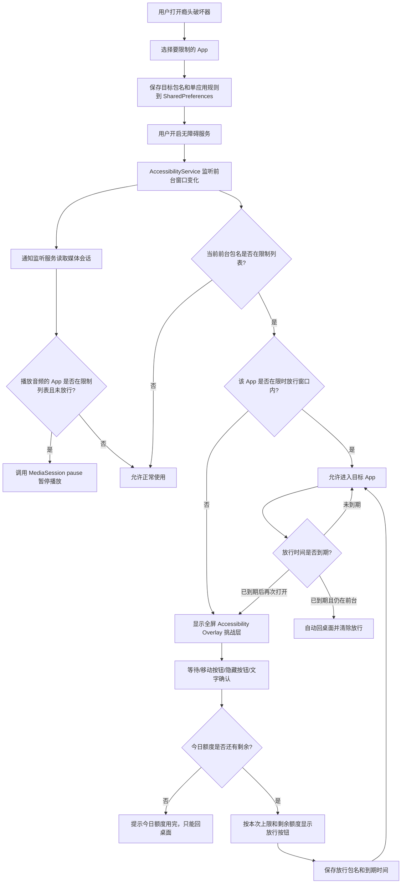
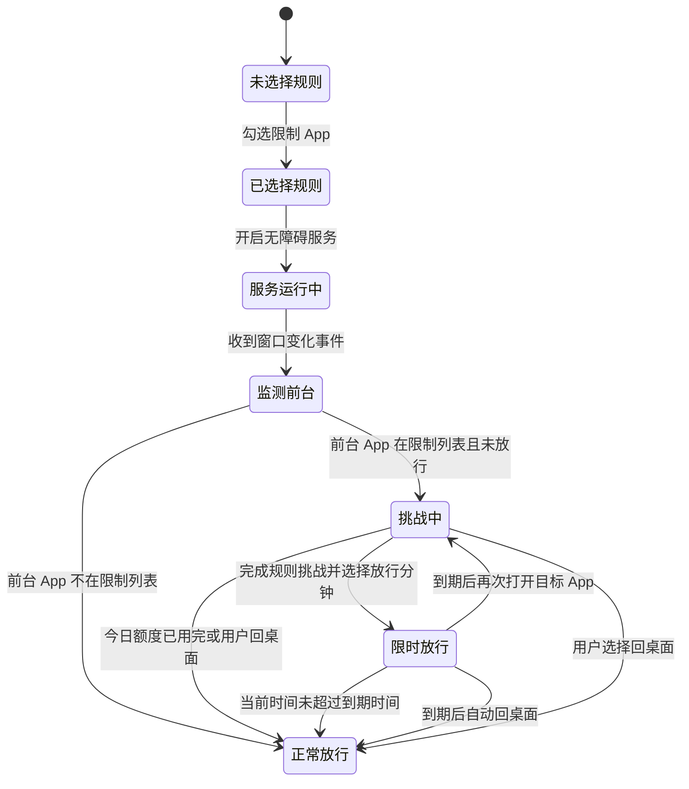

# 瘾头破坏器功能触发示意图

本文说明瘾头破坏器现在的 MVP 是怎么触发、判断、拦截和放行的。

## 核心目标

瘾头破坏器不是直接杀死目标 App，而是在用户打开被限制 App 时，用 Android 无障碍服务识别前台包名，然后显示一个全屏挑战层。用户可以为每个 App 设置等待秒数、互动点击、按钮隐藏、文字确认、每日额度和本次使用上限。对于后台继续播放音频的 App，用户开启通知访问后，服务会读取媒体会话，并在未放行时尝试暂停播放。

## 总流程图



## 状态变化图



## 关键触发点

| 触发点 | 代码位置 | 作用 |
| --- | --- | --- |
| 增加 App | `AddAppActivity` | 搜索 launcher apps，打开右侧胶囊开关。 |
| 设置规则 | `AppRuleActivity` | 保存每日额度、本次上限、等待、互动点击、隐藏和文字确认。 |
| 开启服务 | `BusterAccessibilityService.onServiceConnected` | 服务启动后开始接收窗口事件。 |
| 前台变化 | `BusterAccessibilityService.onAccessibilityEvent` | 收到当前前台包名和 Activity class。 |
| 命中规则 | `blocked=true` | 当前包名存在于限制列表。 |
| 显示挑战 | `showChallengeOverlay` | 用 `TYPE_ACCESSIBILITY_OVERLAY` 显示全屏挑战层。 |
| 完成挑战 | overlay 规则完成 | 按本次上限和每日剩余额度启用放行按钮。 |
| 限时放行 | `RuleStore.grantPassthrough` | 保存目标包名和到期时间，到期前不再重复挑战。 |
| 自动踢出 | `schedulePassthroughExpiryCheck` | 放行到期且目标 App 仍在前台时执行回桌面。 |
| 到期再拦 | `RuleStore.hasPassthrough` | 到期后清除放行状态，再次打开会显示挑战层。 |
| 后台音频阻断 | `BusterNotificationListenerService` | 用户开启通知访问后，读取活跃媒体会话，发现被限制 App 未放行就调用 `pause()`。 |

## 日志怎么看

诊断日志里最关键的是这几类：

```text
[service] connected blockedPackages=[...]
[event] window type=... package=... blocked=true passthrough=false activeChallenge=null
[challenge] show overlay package=...
[challenge] overlay countdown complete package=...
[challenge] overlay action tap package=...
[challenge] overlay confirm matched package=...
[rule] grant passthrough package=... minutes=...
[usage] add usage package=...
[service] allow because passthrough is active: ...
[service] kick target home because passthrough expired package=...
[media] pause blocked media package=... reason=...
```

如果 `blocked=true` 但没有 `show overlay`，说明挑战层没有创建。  
如果有 `show overlay`，但刚点继续又立刻再次挑战，通常是放行策略太短或被清除。0.1.3 起放行会按 5/10 分钟到期时间计算，不会因为切到桌面或系统浮层马上清掉。
如果后台仍然有声音，重点看有没有 `[media] pause blocked media ...`。有这行说明瘾头破坏器已经通过媒体会话发出暂停；如果目标 App 仍继续播放，说明该 App 没有暴露可控制的媒体会话或拒绝响应，需要后续引入 Device Owner、Shizuku 或 root 级能力。

## 当前不做的功能

- 不做多规则组和日程表。
- 不拦截网页。
- 不上传数据，所有规则和诊断日志都只保存在本机。

## 后台阻断能力边界

普通 Android APK 不能真正冻结或强停其他 App。原因是系统不允许普通第三方 App 随意停掉别的包：

- `killBackgroundProcesses(packageName)` 在 Android 14 及以上只能被第三方 App 用来杀自己的进程，不能杀别的 App。
- `DevicePolicyManager.setPackagesSuspended(...)` 可以真正暂停包，让它不能启动 Activity、隐藏通知等，但调用者必须是 Device Owner、Profile Owner 或被授权的企业管理组件。
- root、Shizuku、ADB shell 可以做更强的 force-stop / suspend，但这已经不是普通用户安装 APK 后自动可用的能力。

所以当前最接近的实现路径是：

1. 前台打开被限制 App：用无障碍事件识别包名，显示 overlay 挑战层。
2. 挑战后按规则放行：保存包名和到期时间，到期前允许使用。
3. 后台继续播放声音：通过通知监听权限读取媒体会话，发现被限制 App 未放行却在播放时，调用媒体会话 `pause()`。
4. 到期后仍在前台：执行回桌面；到期后仍在后台播放：再次尝试暂停媒体。

如果后续要做“真正冻结”，推荐单独做一个高级模式：

- Device Owner 模式：通过 ADB 初始化设备管理权限，再用 `setPackagesSuspended` 冻结目标 App。
- Shizuku 模式：用户授权后调用 shell 级能力执行 `am force-stop` 或 `cmd package suspend`。
- Root 模式：直接执行系统级冻结/强停命令。
