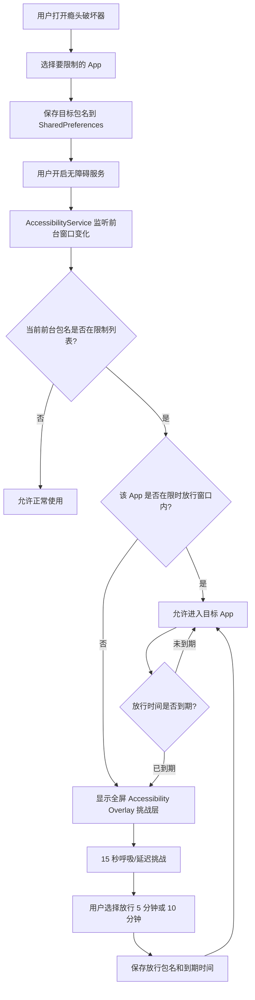
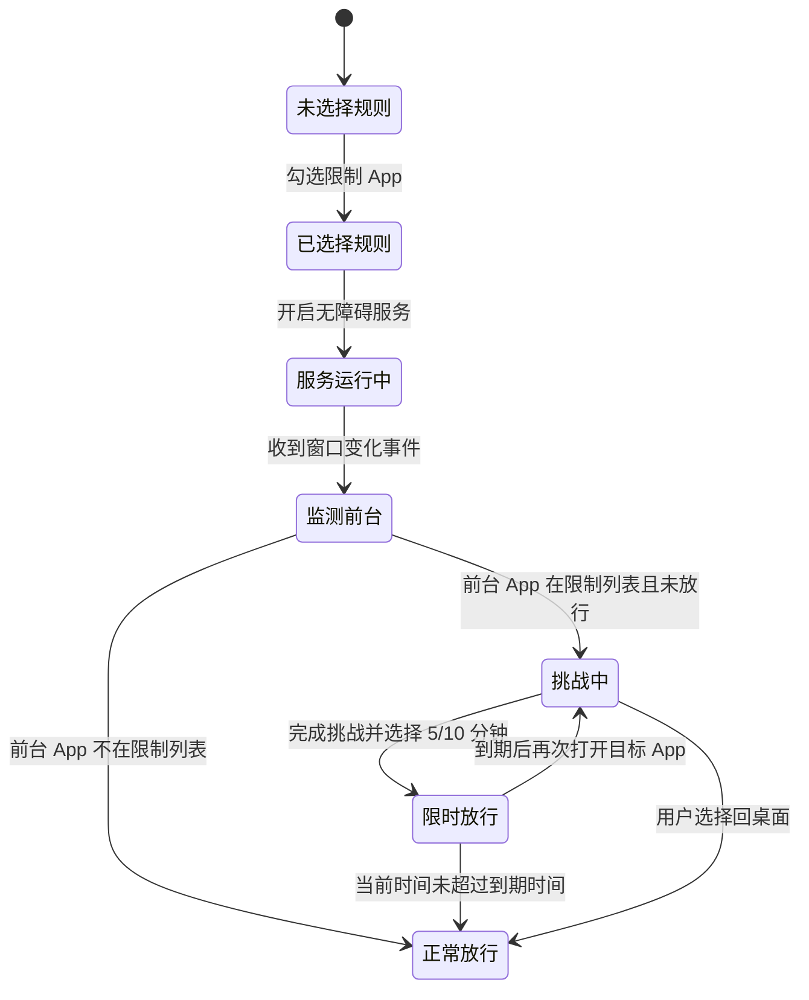

# 瘾头破坏器功能触发示意图

本文说明瘾头破坏器现在的 MVP 是怎么触发、判断、拦截和放行的。

## 核心目标

瘾头破坏器不是直接杀死目标 App，而是在用户打开被限制 App 时，用 Android 无障碍服务识别前台包名，然后显示一个全屏挑战层。用户完成 15 秒呼吸挑战后，可以选择本次放行时长，例如 5 分钟或 10 分钟。

## 总流程图



## 状态变化图



## 关键触发点

| 触发点 | 代码位置 | 作用 |
| --- | --- | --- |
| 勾选 App | `MainActivity` | 保存被限制 App 包名，例如 `com.dragon.read`。 |
| 开启服务 | `BusterAccessibilityService.onServiceConnected` | 服务启动后开始接收窗口事件。 |
| 前台变化 | `BusterAccessibilityService.onAccessibilityEvent` | 收到当前前台包名和 Activity class。 |
| 命中规则 | `blocked=true` | 当前包名存在于限制列表。 |
| 显示挑战 | `showChallengeOverlay` | 用 `TYPE_ACCESSIBILITY_OVERLAY` 显示全屏挑战层。 |
| 完成挑战 | overlay 倒计时结束 | 启用 5 分钟 / 10 分钟放行按钮。 |
| 限时放行 | `RuleStore.grantPassthrough` | 保存目标包名和到期时间，到期前不再重复挑战。 |
| 到期再拦 | `RuleStore.hasPassthrough` | 到期后清除放行状态，再次显示挑战层。 |

## 日志怎么看

诊断日志里最关键的是这几类：

```text
[service] connected blockedPackages=[...]
[event] window type=... package=... blocked=true passthrough=false activeChallenge=null
[challenge] show overlay package=...
[challenge] overlay countdown complete package=...
[rule] grant passthrough package=... minutes=...
[service] allow because passthrough is active: ...
```

如果 `blocked=true` 但没有 `show overlay`，说明挑战层没有创建。  
如果有 `show overlay`，但刚点继续又立刻再次挑战，通常是放行策略太短或被清除。0.1.3 起放行会按 5/10 分钟到期时间计算，不会因为切到桌面或系统浮层马上清掉。

## 当前不做的功能

- 不统计每天总使用时长。
- 不做多规则组和日程表。
- 不拦截网页。
- 不上传数据，所有规则和诊断日志都只保存在本机。
